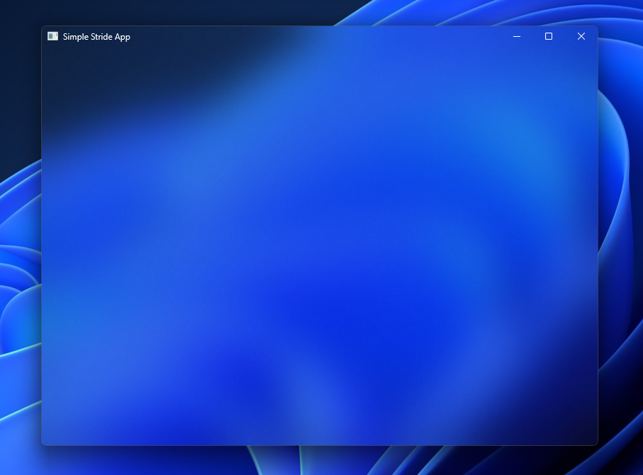

# Stride
A cross-platform application framework written in .NET 9.

## Getting Started
Download this NuGet package, then create and run an app:

```csharp
using Stride.Core.Builders;
using Stride.Core.Factories;
using Stride.Renderer.Services;

// create a blurry, transparent 800x600 window with a title bar
var window = new WindowBuilder()
    .Create("Main Window", 800, 600, blur: true, titleBar: true, transparent: true)
    .Build();

// create a dark mode application
var app = new ApplicationFactory()
    .CreateApplication("Simple Stride App", window, darkMode: true);

// use a new application renderer
using var appRenderer = new ApplicationRenderService();

// create a new renderer and render the app
var renderer = new RenderService(appRenderer);
renderer.Render(app);
```

This creates an application that looks like this:



You can also use Stride in a dependency injection application:

```csharp
using Microsoft.Extensions.DependencyInjection;
using Microsoft.Extensions.Hosting;
using Stride.Abstractions.Services;
using Stride.Core.Extensions;
using Stride.Renderer.Extensions;

// create the application builder
var builder = Host.CreateApplicationBuilder(args);

// add the Stride services to dependency injection services container
builder.Services
    .AddStrideCore()
    .AddStrideRenderer();

// get the Stride service
var provider = builder.Services.BuildServiceProvider();
var stride = provider.GetRequiredService<IStrideService>();

// create, customize, and run the Stride app
stride.CreateApp("Dependency Injected Stride App", 800, 600)
    .WithBlur()
    .WithTitleBar()
    .WithDarkMode()
    .WithTransparency()
    .Run();
```

## Support
Stride is supported on the following platforms.

|Platform|Supported|
|--------|:-------:|
|Windows | ✅ |
|MacOs   | ⚠️ |
|Linux   | ⚠️ |